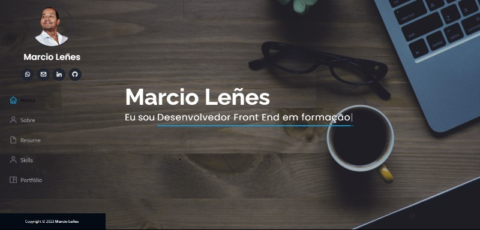

# meu-portfolio

## Meu Portfolio
### Lugar onde deixarei alguns projetos nessa minha jornada
 

  </img>

  </img>

  </img>

 

### Tecnologias utilizadas:

 

  
  
  

 

### Visualização do projeto: 

- [Bistrô do Marcio](https://bistro-do-marcio.netlify.app/)
